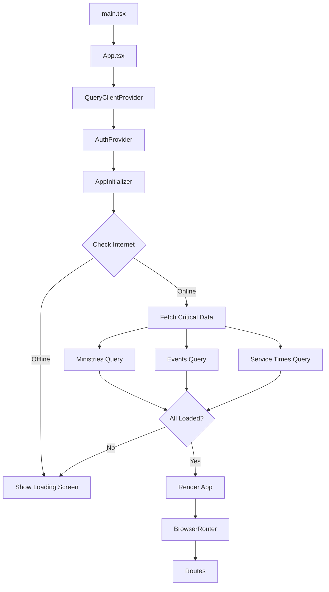
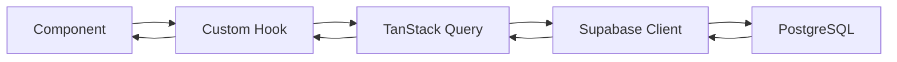
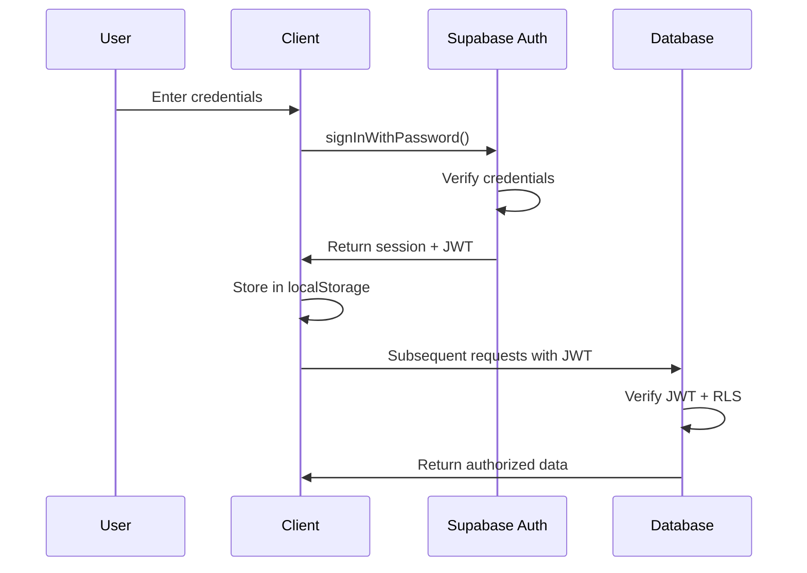
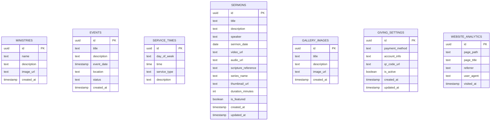
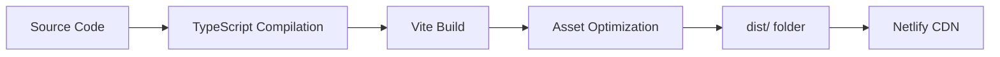

# Architecture Documentation

This document describes the system architecture, design decisions, and technical implementation of the iCare Church Website.

## Table of Contents

- [Overview](#overview)
- [Technology Stack](#technology-stack)
- [Project Structure](#project-structure)
- [Application Flow](#application-flow)
- [Data Flow](#data-flow)
- [Authentication \& Authorization](#authentication--authorization)
- [Database Schema](#database-schema)
- [Design Patterns](#design-patterns)
- [Performance Optimizations](#performance-optimizations)

## Overview

The iCare Church Website is a modern single-page application (SPA) built with React and TypeScript, using Supabase as the backend. The architecture follows a component-based approach with clear separation of concerns between presentation, business logic, and data access layers.

### Key Architectural Decisions

- **Frontend Framework**: React 18 for component-based UI development
- **Type Safety**: TypeScript for compile-time type checking
- **Build Tool**: Vite for fast development and optimized production builds
- **Backend**: Supabase (PostgreSQL + Auth + Storage) for a complete backend solution
- **State Management**: TanStack Query for server state, React Context for auth state
- **Routing**: React Router v6 for client-side navigation
- **UI Components**: Radix UI + shadcn/ui for accessible, customizable components

## Technology Stack

### Frontend Layer

#### Core Technologies
- **React 18.3.1**: Component-based UI library with hooks
- **TypeScript 5.8.3**: Static type checking
- **Vite 5.4.19**: Build tool and development server

#### Routing & Navigation
- **React Router v6.30.1**: Declarative routing with nested routes
- Client-side routing with browser history API
- Protected routes for admin pages

#### State Management
- **TanStack Query 5.83.0**: Server state management
  - Automatic caching and invalidation
  - Background refetching
  - Optimistic updates
  - Query deduplication
- **React Context**: Authentication state
- **React Hook Form**: Form state management

#### UI Framework
- **Tailwind CSS 3.4.17**: Utility-first CSS framework
- **Radix UI**: Accessible, unstyled component primitives
- **shadcn/ui**: Pre-built component library built on Radix UI
- **Lucide React**: Icon library with 1000+ icons

### Backend Layer

#### Supabase Services
- **PostgreSQL Database**: Relational database with JSON support
- **Supabase Auth**: Email/password authentication
- **Supabase Storage**: File storage for images and media
- **Row Level Security (RLS)**: Database-level authorization
- **Real-time Subscriptions**: Live data updates (optional)

### Additional Libraries

- **Form Handling**: React Hook Form + Zod validation
- **Date Utilities**: date-fns for date formatting and manipulation
- **Maps**: Leaflet for interactive maps
- **Charts**: Recharts for analytics visualization
- **Notifications**: Sonner for toast notifications

## Project Structure

```
icarewebsitenew/
├── src/
│   ├── components/              # React components
│   │   ├── admin/              # Admin-specific components
│   │   │   ├── AdminAnalytics.tsx
│   │   │   ├── AdminChurchInfo.tsx
│   │   │   ├── AdminEvents.tsx
│   │   │   ├── AdminGallery.tsx
│   │   │   ├── AdminGiving.tsx
│   │   │   ├── AdminMinistries.tsx
│   │   │   ├── AdminSermons.tsx
│   │   │   ├── AdminServiceTimes.tsx
│   │   │   ├── AdminSidebar.tsx
│   │   │   └── ImageUpload.tsx
│   │   ├── layout/             # Layout components
│   │   │   ├── Header.tsx
│   │   │   ├── Footer.tsx
│   │   │   └── Navigation.tsx
│   │   ├── ui/                 # shadcn/ui components
│   │   │   └── [50+ UI components]
│   │   ├── AppLoadingScreen.tsx
│   │   ├── Map.tsx
│   │   ├── NavLink.tsx
│   │   ├── PageTracker.tsx
│   │   └── SectionNav.tsx
│   ├── hooks/                  # Custom React hooks
│   │   ├── use-mobile.tsx
│   │   ├── use-toast.ts
│   │   ├── useAnalytics.ts
│   │   ├── useAuth.tsx
│   │   └── useChurchData.tsx
│   ├── integrations/           # Third-party integrations
│   │   └── supabase/
│   │       ├── client.ts       # Supabase client configuration
│   │       └── types.ts        # Database type definitions
│   ├── lib/                    # Utility functions
│   │   └── utils.ts            # Helper functions (cn, etc.)
│   ├── pages/                  # Page components (routes)
│   │   ├── Index.tsx           # Home page
│   │   ├── About.tsx
│   │   ├── Services.tsx
│   │   ├── Ministries.tsx
│   │   ├── Events.tsx
│   │   ├── Sermons.tsx
│   │   ├── Contact.tsx
│   │   ├── Giving.tsx
│   │   ├── Gallery.tsx
│   │   ├── Auth.tsx            # Login page
│   │   ├── Admin.tsx           # Admin dashboard
│   │   └── NotFound.tsx        # 404 page
│   ├── App.tsx                 # Main app component
│   ├── main.tsx                # Entry point
│   ├── App.css                 # App-specific styles
│   └── index.css               # Global styles
├── supabase/
│   ├── config.toml             # Supabase configuration
│   └── migrations/             # Database migrations
│       ├── [timestamp]_*.sql   # Migration files
│       └── ...
├── public/                     # Static assets
│   ├── _redirects              # Netlify redirects
│   └── ...
├── .env.example                # Environment variable template
├── netlify.toml                # Netlify configuration
├── package.json                # Dependencies and scripts
├── tailwind.config.ts          # Tailwind configuration
├── tsconfig.json               # TypeScript configuration
└── vite.config.ts              # Vite configuration
```

### Directory Organization Principles

1. **Components by Type**: Components are organized by their purpose (admin, layout, ui)
2. **Pages as Routes**: Each page component corresponds to a route
3. **Hooks for Logic**: Business logic extracted into custom hooks
4. **Integrations Isolated**: Third-party services in separate directory
5. **Type Safety**: TypeScript types generated from Supabase schema

## Application Flow

### Initialization Sequence



### Loading Strategy

The app uses a progressive loading strategy:

1. **Initial Load**: Display loading screen with Bible verses
2. **Critical Data**: Fetch ministries, events, and service times
3. **Progress Tracking**: Show progress bar based on query completion
4. **Graceful Degradation**: Continue even if some queries fail
5. **Cached Data**: Use TanStack Query cache for subsequent visits

### Route Structure

```typescript
<Routes>
  <Route path="/" element={<Index />} />
  <Route path="/about" element={<About />} />
  <Route path="/services" element={<Services />} />
  <Route path="/ministries" element={<Ministries />} />
  <Route path="/events" element={<Events />} />
  <Route path="/sermons" element={<Sermons />} />
  <Route path="/contact" element={<Contact />} />
  <Route path="/giving" element={<Giving />} />
  <Route path="/gallery" element={<Gallery />} />
  <Route path="/auth" element={<Auth />} />
  <Route path="/admin" element={<Admin />} />  {/* Protected */}
  <Route path="*" element={<NotFound />} />
</Routes>
```

## Data Flow

### Data Fetching Pattern

The application uses a consistent pattern for data fetching:



### Example: Fetching Ministries

```typescript
// 1. Component uses custom hook
const { data: ministries, isLoading } = useMinistries();

// 2. Custom hook uses TanStack Query
export const useMinistries = () => {
  return useQuery({
    queryKey: ['ministries'],
    queryFn: async () => {
      const { data, error } = await supabase
        .from('ministries')
        .select('*')
        .order('name');
      if (error) throw error;
      return data;
    },
  });
};

// 3. Supabase client handles the request
// 4. PostgreSQL returns data with RLS applied
```

### State Management Strategy

- **Server State**: Managed by TanStack Query
  - Church data (ministries, events, sermons, etc.)
  - User-generated content
  - Analytics data
- **Client State**: Managed by React hooks
  - Form state (React Hook Form)
  - UI state (modals, dropdowns)
  - Theme preferences
- **Auth State**: Managed by React Context
  - Current user
  - Session status
  - User roles

## Authentication & Authorization

### Authentication Flow



### Authorization Levels

1. **Public (Anonymous)**
   - Read access to all public content
   - View ministries, events, sermons, gallery
   - No write access

2. **Authenticated (Admin)**
   - Full read access
   - Write access to all tables (via RLS policies)
   - Access to admin dashboard
   - File upload permissions

### Protected Routes

The `/admin` route is protected by checking authentication state:

```typescript
// In Admin.tsx
const { user, loading } = useAuth();

if (loading) return <LoadingSpinner />;
if (!user) return <Navigate to="/auth" />;

return <AdminDashboard />;
```

## Database Schema

### Tables Overview



### Row Level Security (RLS) Policies

All tables have RLS enabled with the following pattern:

**Public Read Access**:
```sql
CREATE POLICY "Enable read access for all users"
ON public.[table_name]
FOR SELECT
TO public
USING (true);
```

**Authenticated Write Access**:
```sql
CREATE POLICY "Enable insert for authenticated users only"
ON public.[table_name]
FOR INSERT
TO authenticated
WITH CHECK (true);
```

### Storage Buckets

- **gallery**: Public bucket for gallery images
  - Public read access
  - Authenticated write/delete access
  - Max 15 images enforced at application level

## Design Patterns

### Component Patterns

1. **Container/Presentational Pattern**
   - Pages are containers that fetch data
   - Components are presentational and receive props

2. **Compound Components**
   - UI components from shadcn/ui use compound pattern
   - Example: `<Dialog>`, `<DialogTrigger>`, `<DialogContent>`

3. **Custom Hooks for Logic**
   - Business logic extracted into hooks
   - Reusable across components
   - Example: `useChurchData`, `useAuth`, `useAnalytics`

### Code Organization Patterns

1. **Feature-Based Organization**
   - Admin components grouped together
   - Related functionality co-located

2. **Separation of Concerns**
   - Data fetching in hooks
   - UI in components
   - Types in separate files

3. **Configuration Over Code**
   - Environment variables for configuration
   - Centralized constants

### Error Handling

1. **Query Error Handling**
   ```typescript
   const { data, error, isError } = useQuery({...});
   if (isError) return <ErrorMessage error={error} />;
   ```

2. **Form Validation**
   ```typescript
   const schema = z.object({...});
   const form = useForm({ resolver: zodResolver(schema) });
   ```

3. **Toast Notifications**
   ```typescript
   toast.error("Failed to save changes");
   toast.success("Changes saved successfully");
   ```

## Performance Optimizations

### Build Optimizations

1. **Code Splitting**: Automatic route-based code splitting via Vite
2. **Tree Shaking**: Unused code eliminated in production builds
3. **Minification**: JavaScript and CSS minified
4. **Asset Optimization**: Images and static assets optimized

### Runtime Optimizations

1. **Query Caching**: TanStack Query caches all server data
   - 5-minute stale time
   - Background refetching
   - Automatic cache invalidation

2. **Lazy Loading**: Components loaded on demand
   - Route-based code splitting
   - Image lazy loading

3. **Memoization**: React.memo for expensive components
   - Prevents unnecessary re-renders
   - Used selectively for performance-critical components

4. **Debouncing**: Search inputs debounced
   - Reduces API calls
   - Improves user experience

### Network Optimizations

1. **Request Deduplication**: TanStack Query deduplicates identical requests
2. **Retry Logic**: Failed requests automatically retried (3 attempts)
3. **Optimistic Updates**: UI updates before server confirmation
4. **Prefetching**: Critical data prefetched during app initialization

### Loading Strategy

1. **Progressive Loading**: Show content as it becomes available
2. **Skeleton Screens**: Loading placeholders for better UX
3. **Error Boundaries**: Graceful error handling
4. **Offline Support**: Basic functionality with cached data

## Deployment Architecture

### Build Process



### Environment Configuration

- **Development**: `.env.local` with local Supabase project
- **Production**: Environment variables set in Netlify dashboard
- **Required Variables**:
  - `VITE_SUPABASE_URL`
  - `VITE_SUPABASE_PUBLISHABLE_KEY`

### Hosting

- **Platform**: Netlify
- **CDN**: Global edge network
- **SSL**: Automatic HTTPS
- **Redirects**: SPA routing handled via `_redirects` file

## Security Considerations

1. **Authentication**: Supabase Auth with secure session management
2. **Authorization**: Row Level Security on all database tables
3. **Input Validation**: Zod schemas validate all user input
4. **XSS Prevention**: React automatically escapes output
5. **CSRF Protection**: Supabase handles CSRF tokens
6. **Environment Variables**: Secrets never committed to repository
7. **Content Security**: File upload restrictions and validation

See [SECURITY.md](./documentations/SECURITY.md) for detailed security documentation.

## Future Considerations

### Potential Enhancements

1. **Progressive Web App (PWA)**: Add service worker for offline support
2. **Internationalization (i18n)**: Multi-language support
3. **Advanced Analytics**: User behavior tracking and insights
4. **Push Notifications**: Event reminders and announcements
5. **Advanced Search**: Full-text search across all content
6. **Social Sharing**: Share sermons and events on social media
7. **Email Integration**: Newsletter and event notifications
8. **Mobile Apps**: React Native apps for iOS and Android

### Scalability Considerations

1. **Database Indexing**: Add indexes for frequently queried columns
2. **CDN for Media**: Use dedicated CDN for images and videos
3. **Caching Strategy**: Implement Redis for server-side caching
4. **Load Balancing**: Multiple Supabase instances for high traffic
5. **Monitoring**: Application performance monitoring (APM)
