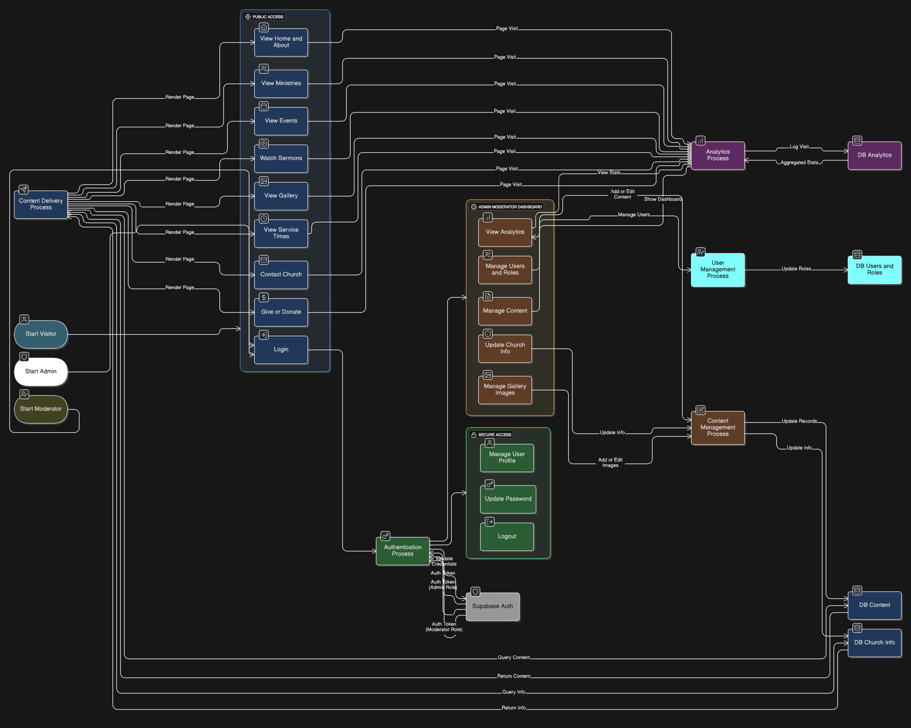
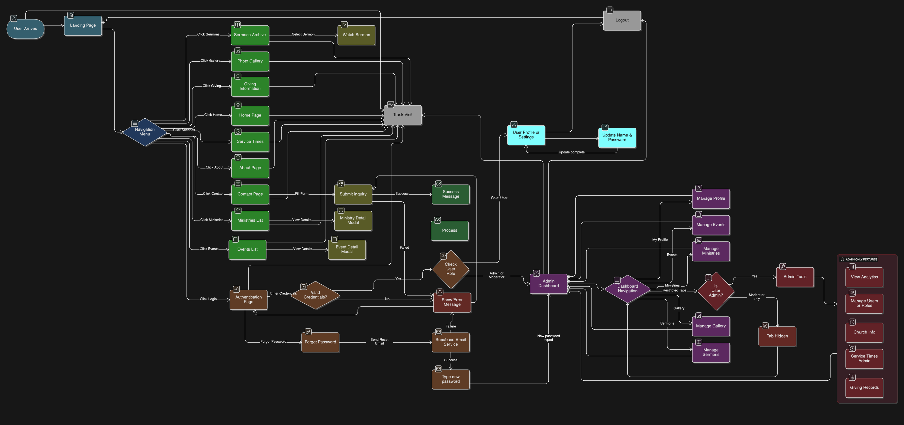

# System Diagrams

This document outlines the system architecture through a Use Case Diagram and a comprehensive Data Flow Diagram.

## Use Case Diagram

The following diagram illustrates the interactions between different actors (Visitor, Authenticated User, Admin) and the system.

## Level 3/4 Data Flow Diagram (Comprehensive System FLow)

This diagram details the atomic logic and data flow across the entire system, combining Authentication, Content Delivery, Content Management, and Analytics into a single view.

## System Flowchart

The following flowchart details the user navigation paths, decision points, and system states from an end-user perspective.

