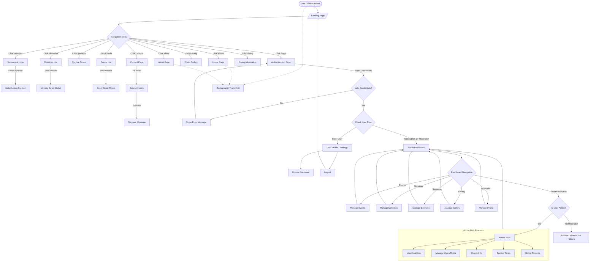

# System Diagrams

This document outlines the system architecture through a Use Case Diagram and a comprehensive Data Flow Diagram.

## Use Case Diagram

The following diagram illustrates the interactions between different actors (Visitor, Authenticated User, Admin) and the system.

```mermaid
useCaseDiagram
    actor "Public Visitor" as Visitor
    actor "Authenticated User" as User
    actor "Administrator" as Admin
    actor "Moderator" as Mod

    package "Public Access" {
        usecase "View Home & About" as UC1
        usecase "View Ministries" as UC2
        usecase "View Events" as UC3
        usecase "Watch Sermons" as UC4
        usecase "View Gallery" as UC5
        usecase "View Service Times" as UC6
        usecase "Contact Church" as UC7
        usecase "Give/Donate" as UC8
        usecase "Login" as UC9
    }

    package "Secure Access" {
        usecase "Manage User Profile" as UC10
        usecase "Update Password" as UC11
        usecase "Logout" as UC12
    }

    package "Admin / Moderator Dashboard" {
        usecase "Manage Content\n(Events, Ministries, Sermons)" as UC13
        usecase "Manage Gallery Images" as UC14
        usecase "Update Church Info" as UC15
        usecase "View Analytics" as UC16
        usecase "Manage Users & Roles" as UC17
    }

    Visitor --> UC1
    Visitor --> UC2
    Visitor --> UC3
    Visitor --> UC4
    Visitor --> UC5
    Visitor --> UC6
    Visitor --> UC7
    Visitor --> UC8
    Visitor --> UC9

    User --> UC10
    User --> UC11
    User --> UC12

    Admin --> UC10
    Admin --> UC11
    Admin --> UC12
    Admin --> UC13
    Admin --> UC14
    Admin --> UC15
    Admin --> UC16
    Admin --> UC17

    Mod --> UC10
    Mod --> UC11
    Mod --> UC12
    Mod --> UC13
    Mod --> UC14
```

## Level 3/4 Data Flow Diagram (Comprehensive System FLow)

This diagram details the atomic logic and data flow across the entire system, combining Authentication, Content Delivery, Content Management, and Analytics into a single view.

```mermaid
graph TD
    %% --- Entities ---
    Visitor["Visitor / User"]
    Admin["Administrator"]
    SystemAuth["Supabase Auth Service"]

    %% --- Data Stores (Database Tables) ---
    subgraph Database ["Supabase Database & Storage"]
        DS_Users[("Table: auth.users\npublic.users\npublic.user_roles")]
        DS_Sermons[("Table: sermons")]
        DS_Events[("Table: events")]
        DS_Ministries[("Table: ministries")]
        DS_Gallery[("Table: gallery_images")]
        DS_Info[("Table: church_info")]
        DS_Anal_Visits[("Table: analytics_visits")]
        DS_Anal_Stats[("Table: analytics_daily_stats")]
        DS_Storage[("Storage Bucket:\nImages/Media")]
    end

    %% --- Browser/Client Side Storage ---
    subgraph ClientStorage ["Client Storage"]
        Store_Local["LocalStorage\n(Visitor ID)"]
        Store_Session["SessionStorage\n(Session ID)"]
        Store_Query["React Query Cache"]
    end

    %% --- PROCESS: AUTHENTICATION ---
    subgraph Authflow ["Process 1.0: Authentication & Authorization"]
        P1_1("1.1 Login Request")
        P1_2("1.2 Validated Credentials")
        P1_3("1.3 Issue JWT Token")
        P1_4("1.4 Fetch User Role")
        P1_5("1.5 Persist Session")
    end

    %% --- PROCESS: PAGE TRACKING ---
    subgraph AnalyticsFlow ["Process 2.0: Analytics Tracking"]
        P2_1("2.1 On Route Change")
        P2_2("2.2 Get/Gen Visitor ID")
        P2_3("2.3 Get/Gen Session ID")
        P2_4("2.4 Send Visit Payload")
        P2_5("2.5 DB Aggregation Trigger")
    end

    %% --- PROCESS: PUBLIC CONTENT ---
    subgraph ContentFlow ["Process 3.0: Content Reading"]
        P3_1("3.1 Fetch Ministries")
        P3_2("3.2 Fetch Events")
        P3_3("3.3 Fetch Sermons")
        P3_4("3.4 Fetch Church Info")
    end

    %% --- PROCESS: ADMIN MANAGEMENT ---
    subgraph AdminFlow ["Process 4.0: Content Management"]
        P4_1("4.1 Verify Admin Role")
        P4_2("4.2 Form Validation")
        P4_3("4.3 Upload Media")
        P4_4("4.4 Insert/Update DB Row")
        P4_5("4.5 Invalidate Cache")
    end

    %% --- FLOW CONNECTIONS ---

    %% Authentication
    Visitor -- "1. Submit Login" --> P1_1
    P1_1 -- "API Call" --> SystemAuth
    SystemAuth -- "Verify" --> DS_Users
    SystemAuth -- "Success" --> P1_2
    P1_2 --> P1_3
    P1_3 --> P1_4
    P1_4 -- "Query Role" --> DS_Users
    DS_Users -- "Return Role" --> P1_4
    P1_4 --> P1_5
    P1_5 -- "Store Token" --> Store_Local
    P1_5 -- "Update State" --> Visitor

    %% Analytics
    Visitor -- "2. Navigate Page" --> P2_1
    P2_1 --> P2_2
    P2_2 <--> Store_Local
    P2_1 --> P2_3
    P2_3 <--> Store_Session
    P2_3 --> P2_4
    P2_4 -- "INSERT: page_path, ids" --> DS_Anal_Visits
    DS_Anal_Visits -.-> P2_5
    P2_5 -- "UPSERT: daily counts" --> DS_Anal_Stats

    %% Public Content Read
    Visitor -- "3. View Pages" --> ContentFlow
    P3_1 -- "SELECT *" --> DS_Ministries
    P3_2 -- "SELECT *" --> DS_Events
    P3_3 -- "SELECT *" --> DS_Sermons
    P3_4 -- "SELECT *" --> DS_Info
    
    DS_Ministries --> Store_Query
    DS_Events --> Store_Query
    DS_Sermons --> Store_Query
    DS_Info --> Store_Query
    Store_Query -- "Render UI" --> Visitor

    %% Admin Management (Example: Create Sermon)
    Admin -- "4. Create/Edit Content" --> P4_1
    P4_1 -- "Check Permissions" --> DS_Users
    P4_1 -- "Authorized" --> P4_2
    P4_2 -- "Valid Data" --> P4_3
    P4_3 -- "Upload File" --> DS_Storage
    DS_Storage -- "Return Public URL" --> P4_3
    P4_3 --> P4_4
    P4_4 -- "INSERT / UPDATE" --> DS_Sermons
    P4_4 -- "INSERT / UPDATE" --> DS_Events
    P4_4 -- "INSERT / UPDATE" --> DS_Gallery
    P4_4 -- "Success" --> P4_5
    P4_5 -- "Invalidate Queries" --> Store_Query
    Store_Query -- "Refetch Data" --> ContentFlow
```



## System Flowchart

The following flowchart details the user navigation paths, decision points, and system states from an end-user perspective.


